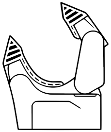

# GRABETTE

<br><br><br>
Open-source toolkit for collecting robotic manipulation demonstrations and
turning them into training-ready datasets.

A GRABETTE rig records synchronized **camera + IMU** streams from hand-held or
gripper-mounted devices, recovers camera trajectories with SLAM, and exports
[LeRobot](https://huggingface.co/docs/lerobot) datasets for policy learning.
The data-collection pipeline is **robot-agnostic**.

🔩 **Build the hardware:** [Bill of Materials](https://docs.google.com/spreadsheets/d/e/2PACX-1vQ3LyyWI-CiplVPtgrWkmLRYjdDqYhbVJXYt8PNa71FDzbTSMVj1YGV0Zpo5PJeBGJURaz8nZt1_v-8/pubhtml) · [CAD — Onshape](https://cad.onshape.com/documents/0c6175c392788391992ff2ec/w/9f773e5f0eeae1577ae36a05/e/13a89fef2591d863bb0bf186)
<br><br><br><br><br><br>
## Components

### `packages/` — robot-agnostic core

| Package | Role | Target | Interface |
|---|---|---|---|
| [`grabette`](packages/grabette) | Hand held data-collection device | Raspberry Pi | HTTP/WebSocket, :8000 |
| [`gripette`](packages/gripette) | Robot mounted Gripper motor | Raspberry Pi Zero 2W | gRPC, :50051 |
| [`grabette-postprocess`](packages/grabette-postprocess) | Data postprocess + SLAM → LeRobot dataset generation | Workstation | CLI |
| [`casquette (WIP)`](packages/casquette) | POV head-mounted device | Raspberry Pi Zero 2W | HTTP/WebSocket, :8001 |

### `integrations/` — integration example (OpenArm 7-DOF arm + Gripette)

| Package | Role |
|---|---|
| [`openarm_gripette`](integrations/openarm/openarm_gripette) | Code to control the OpenArm + Gripette robot |
| [`openarm_gripette_simu`](integrations/openarm/openarm_gripette_simu) | MuJoCo simulation of OpenArm + Gripette and synthetic data collection |
| [`openarm_gripette_model`](integrations/openarm/openarm_gripette_model) | Robot description (URDF / MuJoCo XML) and mesh assets, generated from Onshape |
| [`DiffusionPolicy`](integrations/DiffusionPolicy) | Diffusion Policy training code |
| [`Pi05`](integrations/Pi05) | π0.5 VLA fine-tuning, gates, and remote-GPU deployment (shares the DiffusionPolicy dataset pipeline) |

**Using GRABETTE with a different robot arm:**
the core in `packages/` carries no
OpenArm dependency. To target another platform, add an
`integrations/<your-arm>/` alongside `openarm/` — the OpenArm integration is the
reference example.


## Cloning

The repo uses **Git LFS** for mesh assets (`*.stl`, see `.gitattributes`). Install LFS once per workstation, then clone normally:

```bash
sudo apt install git-lfs             # Debian / Ubuntu / Pi OS — install the binary first
                                     # (macOS: brew install git-lfs; see git-lfs.com for others)
git lfs install                      # one-time per user — configures git filters
git clone git@github.com:pollen-robotics/grabette.git
```

If you cloned **before** `git lfs install`, the `.stl` files are 130-byte pointer text files. Fetch the real binaries:
```bash
cd grabette
git lfs pull
```

Verify:
```bash
file packages/grabette/urdf/grabette_right/assets/*.stl | head -3
# expected: "Binary"   |   bad: "ASCII text" (pointer file → run `git lfs pull`)
```

For on-device installs where you don't need the meshes (Pi services don't load them), skip LFS to save disk + bandwidth:
```bash
GIT_LFS_SKIP_SMUDGE=1 git clone git@github.com:pollen-robotics/grabette.git
```

## Development

Requires [uv](https://docs.astral.sh/uv/). Python ≥ 3.11.

```bash
uv sync --all-packages          # full workspace dev environment
uv run --package grabette python packages/grabette/main.py   # run a service (mock backend by default)
```

> **The one rule to know:** this repo is a single uv **workspace** — one shared
> `.venv` and one `uv.lock` at the root. A bare `uv sync`, run from *anywhere*
> in the repo, builds the **whole workspace** and installs every package's
> dependencies — gigabytes of torch/mujoco on a Raspberry Pi if you're not
> careful. Therefore:
>
> - **Single package / deployment** → `uv sync --package <name>`
>   (extras attach to it: `uv sync --package grabette --extra rpi`).
> - **Full dev environment** → `uv sync --all-packages`.
> - `integrations/DiffusionPolicy` is deliberately **standalone** (own
>   `uv.lock`, heavy training pins) — inside it a plain `uv sync` is correct.

**On-device install (Raspberry Pi):** each device package ships a `make
install-rpi` target that builds the `--system-site-packages` venv `picamera2`
needs (a bare `uv sync` skips it and the service falls back to the mock
backend). Follow the package's own README for the exact steps:
[grabette](packages/grabette), [gripette](packages/gripette),
[casquette](packages/casquette) *(WIP)*.

**Note — `lerobot` / Python 3.12:** `grabette-postprocess` and the sim's
`dataset` extra require Python ≥ 3.12 (gated by an env marker); the on-device
services run fine on 3.11. The OpenArm sim also needs the system `liburdfdom`
package for `placo`.

## Contribution

Two branches:
- **`develop`** takes every PR
- **`main`** is releases only and advances *only* via a `develop → main` PR.

```bash
# feature / fix
git checkout develop && git pull
git checkout -b <issue>     # work, commit, then PR into develop

# release: open a develop → main PR (Actions ▸ "Open release PR"), review, merge
```

CI runs on every PR and on pushes to `main`/`develop`: 
- a `build` job (`uv lock --check`, workspace build, import smoke test)
- a `tests` job.

_Run tests locally with `uv run pytest` — unit tests live in `tests/` (`*_test.py` scripts inside `packages/` are manual bring-up tools, not tests)._


## License

Apache-2.0. See [LICENSE](LICENSE).
