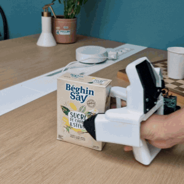
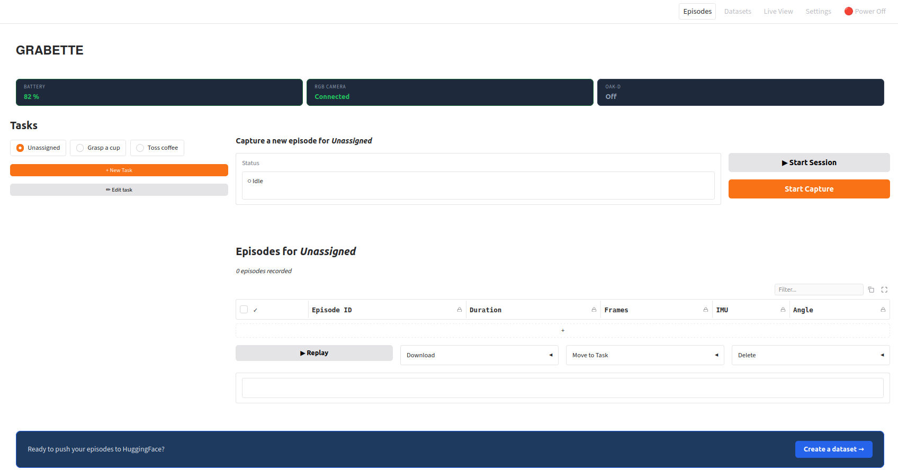

# Grabette

<br>
&nbsp;&nbsp;&nbsp;&nbsp;Autonomous Raspberry Pi service for robotic manipulation data collection:<br>
&nbsp;&nbsp;&nbsp;&nbsp;&nbsp;&nbsp;&bull;&nbsp;captures synchronized camera + depth + IMU streams from a handheld gripper<br>
&nbsp;&nbsp;&nbsp;&nbsp;&nbsp;&nbsp;&bull;&nbsp;manages recording sessions<br>
&nbsp;&nbsp;&nbsp;&nbsp;&nbsp;&nbsp;&bull;&nbsp;uploads episodes to Hugging Face for cloud SLAM processing.

&nbsp;&nbsp;&nbsp;&nbsp;Part of the [GRABETTE project](../../README.md).

<br clear="left"/>

## Hardware

| Component | Spec |
|---|---|
| **Board** | Raspberry Pi 4 |
| **Primary camera** | RPi camera module, 1296x972 @ 46fps, fisheye lens (KannalaBrandt8) |
| **OAK-D SR** | Stereo RGB-D camera with on-board BNO IMU (200Hz). Provides the depth + IMU stream for SLAM — **required** for trajectory recovery on Grabette. Replaces the legacy BMI088. Toggled on demand (default off to save battery; turn it on when recording for the pipeline). |
| **Angle sensors** | 2x AS5600L rotary encoders (proximal + distal finger joints), one per I2C bus (`/dev/i2c-3` distal, `/dev/i2c-4` proximal) |
| **Button** | Grove LED Button (GPIO22 LED, GPIO23 button) — physical start/stop |
| **Speaker** | TLV320AIC3104 codec on the V2 HAT (I2S audio, control on `i2c-1` @ `0x18`, 12 MHz MCLK) — beeps when a recording actually goes live |

**Build the hardware:**

- 📋 **[Full Bill of Materials (BOM)](https://docs.google.com/spreadsheets/d/e/2PACX-1vQ3LyyWI-CiplVPtgrWkmLRYjdDqYhbVJXYt8PNa71FDzbTSMVj1YGV0Zpo5PJeBGJURaz8nZt1_v-8/pubhtml)** — complete parts list (shared for Grabette + Gripette).
- 🧩 **[CAD — Onshape](https://cad.onshape.com/documents/0c6175c392788391992ff2ec/w/9f773e5f0eeae1577ae36a05/e/13a89fef2591d863bb0bf186)** — full Grabette + Gripette CAD.
- 🔩 **Assembly:** [Assembly guide](assembly/Grabette_Assembly.pdf) · [3D-print guide](assembly/Grabette_3DPrint_Guide.pdf) — step-by-step build instructions.

## Install

### Development (mock mode, no hardware needed)

> Part of the uv **workspace**: a bare `uv sync` here would build the *entire
> monorepo* environment. Always pass `--package` (root README → Development).

```bash
uv sync --package grabette
uv run --package grabette python main.py
# → http://localhost:8000
```

### Raspberry Pi

Tested on **Raspberry Pi OS Bookworm (Debian 12)** and **Trixie (Debian 13)**. No specific Pi OS version is pinned — the Makefile target uses whatever system Python is at `/usr/bin/python3` (3.11 on Bookworm, 3.13 on Trixie).

#### Prerequisites

<details>
<summary> 1. Flash the SD card</summary>

1. Download the latest Raspberry Pi Imager from <a href="https://www.raspberrypi.com/software/">here</a>.
2. Plug in your SD card and select Raspberry Pi OS Lite (64-bit) for Raspberry Pi 4.
3. Select the storage device then:
    - Set hostname (e.g., `R-grabette`).
    - Set username and password.
    - Set the WiFi SSID and password.
    - Enable SSH.
4. Click "Write" to flash the SD card.
5. Once the flashing is complete, eject the SD card and insert it into your Raspberry Pi
</details>


2. Install [`uv`](https://docs.astral.sh/uv/), then enable the V2 hardware overlays once and grant rights for network scanning (requires reboot):
```bash
curl -LsSf https://astral.sh/uv/install.sh | sh 
sudo cp config/config.txt /boot/firmware
make install-audio                 # builds the speaker's devicetree overlay — before the reboot
make install-netdev
sudo reboot
```

> `make install-audio` must run **before** this reboot: `config.txt` enables
> `dtoverlay=tlv320aic3104`, which is not a stock Pi overlay — the target
> compiles it from `config/overlays/` into `/boot/firmware/overlays/`. Without
> it the line is silently ignored and there's no speaker (everything else still
> works). See [Speaker](#speaker-audible-recording-cue-make-install-audio).

#### One-shot bringup
A grabette is built as either a **left** or **right** hand — the angle sensors are mounted mirrored, so the daemon needs to know which one this device is. Pick at install time:
```bash
make install-rpi HAND=right    # or HAND=left
uv run python -m grabette
```

> `HAND` is required — running `make install-rpi` without it fails with a clear error. The choice is written to `/etc/grabette/env` as `GRABETTE_HAND=<value>` and persists across reboots (sourced by `grabette.service`).

`make install-rpi HAND=...` does the following — automating the steps that are easy to get subtly wrong by hand:
- `sudo apt install python3-libcamera python3-picamera2 libcap-dev ffmpeg python3-dbus python3-gi` (the dbus/gi packages are system deps for the BLE WiFi service).
- Installs the OAK-D / Movidius USB udev rule (`/etc/udev/rules.d/80-movidius.rules`).
- Creates the venv with `uv venv --python /usr/bin/python3 --system-site-packages` — **both flags matter**:
  - `--python /usr/bin/python3` ensures uv uses the apt-managed Python (which owns `python3-libcamera`/`python3-picamera2`), not uv's own managed Python under `~/.local/share/uv/python/...`.
  - `--system-site-packages` makes the apt-installed `libcamera` and `numpy` visible to the venv.
- Runs `uv sync --package grabette --extra rpi --extra ui --extra hf` and verifies all imports succeed.
- Writes `/etc/grabette/env` with `GRABETTE_HAND=<value>` (preserving any prior `GRABETTE_*_SIGN` overrides).
- Runs `install-ntp` (below) so the device's clock is disciplined against a shared time service.
- Runs `install-audio` (below) so the HAT speaker's overlay + mixer init are in place.

Note: `install-rpi` does **not** install or start the systemd services — that's `make install-systemd` (next section).

### Clock sync for multi-device recording (`make install-ntp`)

Synchronized group recording starts every device at a shared UTC instant that
each waits out on **its own clock**, so any clock offset *between* two grabettes
becomes an offset between their recordings. `make install-ntp` (also run by
`install-rpi`) drops `config/timesyncd-grabette.conf` into
`/etc/systemd/timesyncd.conf.d/grabette.conf`, pinning `systemd-timesyncd` to a
single coordinated anycast service (`time.cloudflare.com`) shared by all
devices — instead of the default `*.pool.ntp.org`, which resolves to a
**different physical server per device** (independent offsets → tens of ms of
relative skew). Verify with `timedatectl timesync-status` (look at `Server:` /
`Offset:`). For the tightest sync (sub-ms), run a local NTP server on the LAN
and point `NTP=` at it (see the comments in `config/timesyncd-grabette.conf`).

If the daemon logs `Using MockBackend` instead of `RPi hardware detected, using RpiBackend`, the venv setup didn't take — `make install-rpi` will fix it on a re-run.

### Speaker: audible recording cue (`make install-audio`)

Each grabette **beeps at the instant its recording actually starts** — i.e. after
the OAK-D warm-up, once the sync clock is running and every stream is recording,
not when the button is pressed. On a synchronized group recording all members
reach that instant at the shared T0, so the whole rig beeps in unison. It's the
audible counterpart of the LED (blink = initializing, solid = recording), for
when you're holding the device and not looking at it.

The hardware is a **TLV320AIC3104** codec on the V2 HAT, driven over I2S — the
same codec on the same HAT as
[microduck](https://github.com/apirrone/microduck_runtime/blob/main/rpi_setup/aic3104-init.sh),
there driven by a Pi Zero 2W. The devicetree overlay is board-independent and is
used unchanged (it binds `&i2c1` + `&i2s`, identical header pins on a Pi 4); what
is Pi-4-specific lives in `config/config.txt` and in how the card is addressed:

- `dtparam=audio=off` + `dtparam=i2s=on` — a Pi 4 also registers the `vc4-hdmi`
  cards, so the codec is **never a stable card index**. Everything therefore
  addresses it **by name** (`plughw:CARD=aic3104`): the daemon, the mixer-init
  script (`amixer -c aic3104`), and the `/etc/asound.conf` written by
  `install-audio`.
- No DKMS wait in the mixer init — on Pi OS `snd_soc_tlv320aic3x` is in-tree and
  autoloads from the devicetree match. Playback only: the HAT's onboard
  microphone routing is dropped, since grabette records no audio.

`make install-audio` (idempotent) does:
- `apt install device-tree-compiler alsa-utils`;
- adds `rasp` to the `audio` group (`/dev/snd/*` is `root:audio 0660`, and the
  daemon runs as `rasp`);
- compiles `config/overlays/tlv320aic3104-overlay.dts` → `/boot/firmware/overlays/tlv320aic3104.dtbo`;
- installs `scripts/aic3104-init.sh` → `/usr/local/bin/` — the codec boots with
  its line outputs muted, so **without this the card exists and plays silence**;
- installs + enables `aic3104-init.service`, which applies those mixer levels at
  every boot, ordered *after* `alsa-restore` (which can otherwise replay a stale
  mute) and *before* `grabette.service`;
- writes `/etc/asound.conf` (default card = `aic3104`) if you don't already have one.

Check it:
```bash
aplay -l | grep aic3104                 # card registered? if not: config.txt + reboot
python scripts/test_speaker.py          # plays the exact cue the daemon plays
sudo /usr/local/bin/aic3104-init.sh     # re-apply the mixer levels (if it's silent)
```
Turn it off with `GRABETTE_SOUND_ENABLED=false` (in `/etc/grabette/env`), or trim
the level with `GRABETTE_SOUND_VOLUME` — see [docs/configuration.md](docs/configuration.md).
A missing or unconfigured codec is never fatal: the daemon logs one line and
records silently.

#### systemd (auto-start on boot)

```bash
make install-systemd
journalctl -u grabette -f               # daemon logs
journalctl -u grabette-bluetooth -f     # BLE WiFi-setup service logs
```
`make install-systemd` installs **both** services (`grabette.service` and `grabette-bluetooth.service`), runs `ensure-ble-only` to set BlueZ to `ControllerMode = le`, then `enable --now`s them so they're up immediately and across reboots.

If you re-run `install-systemd` while the services are already up, `enable --now` does NOT restart them — issue `sudo systemctl restart grabette grabette-bluetooth` to pick up updated unit files.

To put the device on WiFi without a screen or SSH, use the BLE setup service — see **[docs/bluetooth_setup.md](docs/bluetooth_setup.md)**.

## Calibration

Before using Grabette, calibrate the angle sensors. For that, open completely the gripper (Both joints must be fully extended when opening), then run the calibration script:
```bash
python3 scripts/calibrate_angles.py
sudo reboot
```

## Usage

Once running (mock or on-device), open the dashboard at `http://<device>.local:8000`: 
<br>


From the different sections, you can:

**Episodes**:
1. Start/stop a recording (you can either use the button on the device)
2. Create tasks
3. Start/stop a session of recordings for one same task
4. Replay and manage captured episodes.

**Datasets**:
- Trigger postprocessing with SLAM and upload episodes to a Hugging Face dataset repo (LeRobot format).

**Live View**: 
- Preview the cameras and live sensor charts.

**Settings**:
1. Find IP address and device info
2. Manage the Wifi connexion
3. Log in to Hugging Face 


> Recordings are written to `~/grabette-data/` — see the [data format](docs/data_format.md).<br> Downstream SLAM → LeRobot dataset generation is handled by [grabette-postprocess](../grabette-postprocess).

## Documentation

- [Architecture](docs/architecture.md) — daemon internals, API surface, backends.
- [Configuration](docs/configuration.md) — environment variables and the robot-frame angle convention.
- [Data format](docs/data_format.md) — episode layout, calibration & geometry, IMU format, synchronization.
- [Bluetooth WiFi setup](docs/bluetooth_setup.md) — headless WiFi provisioning over BLE.

## Related packages

| Package | Description |
|---|---|
| [gripette](../gripette) | gRPC motor+camera service for the motorized gripper (Pi Zero 2W) |
| [grabette-postprocess](../grabette-postprocess) | SLAM/VIO + LeRobot dataset generation (Docker) |
