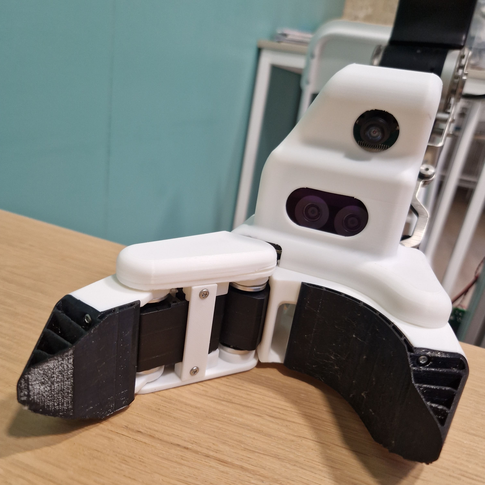

# Gripette
<br>

Gripper version of the [Grabette](../grabette) data collection system.

gRPC motor+camera service for the gripper, running on a Raspberry Pi Zero 2W.

Streams camera frames (JPEG) at ~10Hz synchronized with motor positions, and accepts motor commands for two Feetech STS3215 servos over the network.
<br clear="left"/>

## Hardware

- Raspberry Pi Zero 2W
- RPi camera module (1296x972, fisheye lens)
- Two Feetech STS3215 servos on `/dev/serial0` (baudrate 1000000, IDs 1 and 2)
- *Optional:* an OAK-D SR RGB-D camera — add it if you want depth/SLAM on the gripper; **not required** for the standard motor + camera service (unlike Grabette, where the OAK-D is mandatory for SLAM)

📋 **[Full Bill of Materials (BOM)](https://docs.google.com/spreadsheets/d/e/2PACX-1vQ3LyyWI-CiplVPtgrWkmLRYjdDqYhbVJXYt8PNa71FDzbTSMVj1YGV0Zpo5PJeBGJURaz8nZt1_v-8/pubhtml)** — complete parts list (shared for Grabette + Gripette).
🧩 **[CAD — Onshape](https://cad.onshape.com/documents/0c6175c392788391992ff2ec/w/9f773e5f0eeae1577ae36a05/e/13a89fef2591d863bb0bf186)** — full Grabette + Gripette CAD.
🔩 **Assembly:** [Assembly guide](assembly/Gripette_Assembly.pdf) · [3D-print guide](assembly/Gripette_3DPrint_Guide.pdf) — step-by-step build instructions.

## Install

### Development machine (mock mode, no hardware needed)

> Part of the uv **workspace**: a bare `uv sync` here would build the *entire
> monorepo* environment. Always pass `--package` (root README → Development).

```bash
uv sync --package gripette --extra dev
uv run --package gripette python generate_proto.py   # only if you modified proto/gripper.proto
uv run --package gripette python main.py
```

### Raspberry Pi Zero 2W

####  Prerequisites
A  Pi Zero 2W running Raspberry Pi OS (Bookworm or Trixie), with [uv](https://docs.astral.sh/uv/) installed :

<details>
<summary> Flash the SD card</summary>

1. Download the latest Raspberry Pi Imager from <a href="https://www.raspberrypi.com/software/">here</a>.
2. Plug in your SD card and select Raspberry Pi OS Lite (64-bit) for Raspberry Pi Zero 2W.
3. Select the storage device then:
    - Set hostname (e.g., `R-gripette`).
    - Set username and password.
    - Set the WiFi SSID and password.
    - Enable SSH.
4. Click "Write" to flash the SD card.
5. Once the flashing is complete, eject the SD card and insert it into your Raspberry Pi Zero 2W
</details>

And install uv : 

```bash
curl -LsSf https://astral.sh/uv/install.sh | sh 
```


#### Install the gripette service
A gripette is built as either a **left** or **right** hand — the motors are mounted mirrored, so the runtime needs to know which one this device is. Pick at install time:

```bash
sudo usermod -aG dialout $USER   # serial bus access — log out + back in for it to take effect
make install-rpi HAND=right       # or HAND=left
sudo reboot                       # required if UART/cmdline were changed
make check                        # post-reboot hardware diagnostic (camera + motors)
```

> `HAND` is required — running `make install-rpi` without it fails with a clear error. The choice is written to `/etc/gripette/env` as `GRIPPER_HAND=<value>` and persists across reboots.

`make check` validates the camera and the motor bus. It also probes the two systemd services and reports them as `[SKIP]` if they aren't installed yet — that's the expected state right after `install-rpi`.

Then start the service manually or install at boot:

```bash
uv run --package gripette python -m gripette   # foreground (Ctrl-C to stop)
# — or —
make install-systemd                            # boot-time start (main + bluetooth)
make check                                      # services should now report [OK]
```

`make install-rpi` is idempotent — re-running it is safe (and preserves any captured calibration offsets in `/etc/gripette/env`). Under the hood it:

- installs `python3-libcamera`, `python3-picamera2`, `libcap-dev` via apt;
- runs `make enable-uart` to disable the serial console (`cmdline.txt`) and add `dtoverlay=miniuart-bt` to `config.txt` so the reliable PL011 (`ttyAMA0`) ends up on the GPIO header instead of the mini UART (clock-dependent, unreliable at 1Mbaud);
- runs `make harden-rpi` for crash safety (persistent journal capped at 5 boots / 50MB, and `fsck.mode=force` so a hard shutdown self-heals on next boot — gripettes mounted on a robot get power-cut at random);
- creates a `--system-site-packages` venv at the workspace root so apt's `picamera2` satisfies the dependency tree (otherwise `uv` tries to build `python-prctl` from PyPI);
- runs `uv sync --package gripette --extra rpi --no-install-package numpy` and verifies that `picamera2`, `serial`, and `rustypot` all import;
- writes `GRIPPER_HAND` into `/etc/gripette/env`, preserving any existing `GRIPPER_MOTOR*_OFFSET` lines from a previous calibration.

`make help` lists every target. The cmdline.txt edit captures the `root=PARTUUID=...` token before editing and rolls back from a `.gripette.bak` backup if it changes — boot is safe.

#### Manual installation (fallback)

If `make install-rpi` fails (e.g. unusual OS), the equivalent manual steps are:

1. **UART**: edit `/boot/firmware/config.txt` to include `dtoverlay=miniuart-bt` and `enable_uart=1`. Edit `/boot/firmware/cmdline.txt` to remove `console=serial0,115200` — keep the file as a single line. Reboot.
2. **Deps**: `sudo apt install libcap-dev python3-libcamera python3-picamera2`.
3. **Venv**: from the workspace root, `uv venv --python /usr/bin/python3 --system-site-packages && uv sync --package gripette --extra rpi --no-install-package numpy`.
4. **Hand config**: `sudo mkdir -p /etc/gripette && echo "GRIPPER_HAND=right" | sudo tee /etc/gripette/env` (or `=left`).

## Usage

Drive a running gripette over gRPC with the Python client:

```python
from gripette.client import GripperClient

with GripperClient("<gripette-id>:50051") as g:
    print(g.ping())

    g.torque_on()
    g.move(0.5, 1.0)            # goal positions in radians (0 = open, positive = closing)

    for frame in g.stream():    # 10Hz camera + motor state
        print(f"Frame {frame.sequence}: {len(frame.jpeg_data)}B, "
              f"motors=({frame.motor1:.2f}, {frame.motor2:.2f})")
        break

    m1, m2 = g.read_motors()    # lightweight, no camera
    g.torque_off()
```

The `scripts/` directory holds CLI tools for teleoperation, diagnostics, motor/camera tests, and reset — see [docs/scripts.md](docs/scripts.md).

## systemd

`make install-systemd` installs both services (`gripette.service`, the gRPC motor+camera server, and `gripette-bluetooth.service`), patching the hard-coded workspace path in each unit file to this device's actual root, then enables + starts both.

```bash
make install-systemd
journalctl -u gripette -f             # main service logs
journalctl -u gripette-bluetooth -f   # BT WiFi-setup service logs
```

## Status web UI

The quickest way to check that a gripette is healthy — and to restart the
service or cleanly shut the device down — is its built-in status page:

```bash
make install-web      # once per device: sudoers drop-in + gripette-web.service
```

Then browse to `http://<gripette-hostname>.local:8080` (the install prints
this device's exact URL; the device IP works too). The page shows:

- an **OK / failure banner** — green means service up, gRPC answering, and a
  fresh camera frame flowing through the real `StreamState` pipeline;
- the **live camera view** (~1 Hz), motor positions, and the service's
  auto-restart count (which counts camera-wedge self-heals);
- system vitals (CPU temperature, throttling, WiFi signal, disk) and the
  last journal lines with errors highlighted;
- **Restart service** and **Shut down device** buttons. Both are gated by a
  sudoers rule limited to those two exact commands; shutdown is the clean
  way to power off a gripette (it has no power button).

The UI is a separate process (`gripette-web.service`) and strictly
pull-based: it does nothing while no browser is open, and costs the gripper
service at most ~1 extra camera capture/s while a page is viewing — safe to
leave enabled during data collection and evals. Port override:
`GRIPPER_WEB_PORT` in `/etc/gripette/env`. Note there is no authentication:
anyone on the local network can use the buttons.

## Documentation

- [Configuration](docs/configuration.md) — environment variables and the robot-frame motor convention.
- [Motor setup & assembly](docs/motor_setup.md) — assigning servo IDs for a new gripper.
- [Calibration](docs/calibration.md) — setting the zero (fully-open) offset.
- [Scripts & diagnostics](docs/scripts.md) — teleop bridge, motor/camera tests, reset-to-zero.
- [Bluetooth WiFi setup](docs/bluetooth_setup.md) — headless WiFi provisioning over BLE.

The gRPC contract is defined in `proto/gripper.proto`; regenerate the committed stubs with `generate_proto.py` (see Install → Development).

## Related packages

| Package | Description |
|---|---|
| [grabette](../grabette) | Handheld data-collection device (camera + OAK-D + angle sensors) |
| [grabette-postprocess](../grabette-postprocess) | SLAM/VIO + LeRobot dataset generation (Docker) |
